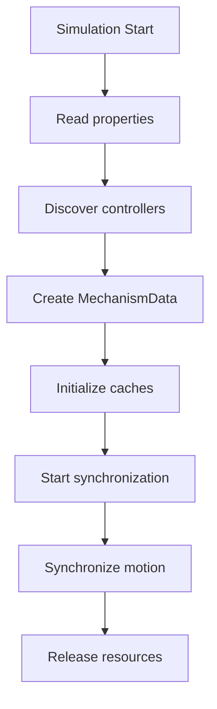

# Main Modules

## CodeBehind.cs

Responsible for the Smart Component lifecycle:

- Simulation startup and shutdown
- Property validation
- Controller discovery
- Event handling
- Synchronization execution

This behavior is mainly implemented in `OnSimulationStart`, `OnSimulationStop`, and `OnSimulationStep`.

## MechanismData.cs

Contains the core synchronization logic:

- Controller management
- `tooldata` and `wobjdata` caching
- RAPID → RobotStudio conversion
- Joint and Cartesian synchronization
- Resource management

## ControllerHelper.cs

Provides utility functions:

- Controller discovery
- Controller connection
- Event logging

# Workflow

