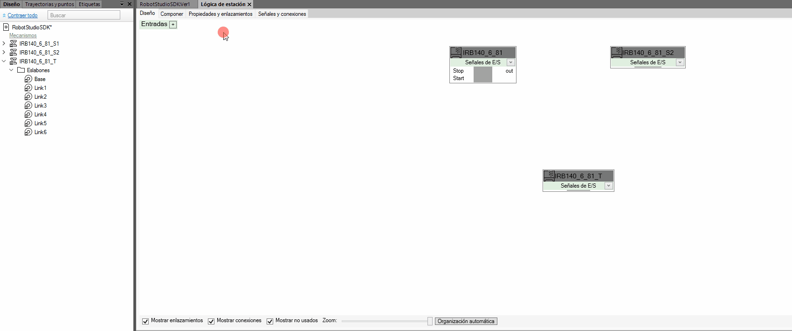

# MotionLinker

## Description
MotionLinker is a RobotStudio Smart Component that synchronizes the motion of a source ABB controller with a target virtual controller. It supports both Joint and Cartesian synchronization modes.

## Features

- Joint motion synchronization
- Cartesian motion synchronization
- Automatic controller discovery
- Support for online and offline controllers
- Synchronization of global and local `tooldata` and `wobjdata` between Source and Target
- Automatic update and visualization of active `tooldata` and `wobjdata` on the Target controller
- Support for coordinated WorkObjects

## Requirements

- RobotStudio 2025
- RobotStudio SDK 2025
- PC SDK 2025
- .NET Framework 4.8
- A station with the same mechanical unit and a *dummy* controller
- The `T_ROB1` task must contain a main program that remains running and does not execute motion instructions that interfere with synchronization

## Configuration / Properties

## Configuration / Properties

| Property | Type | Description |
|-----------|------:|-------------|
| SourceController | String | System name of the source controller. |
| OnlineSource | Bool | Restrict the source controller list to online controllers only. |
| TargetController | String | System name of the target RobotStudio controller. |
| Cartesian | Bool | Enable Cartesian synchronization instead of joint synchronization. |
| OverwriteTools | Bool | Overwrite existing RobotStudio tool data with data from the source controller. |
| OverwriteWobj | Bool | Overwrite existing RobotStudio work object data with data from the source controller. |
| TemporaryStationData | Bool | Remove imported tool and work object data from the RobotStudio station when the simulation stops. |

## Quick Start

1. Add MotionLinker to the station
2. Select `SourceController`
3. Select `TargetController`
4. Choose `Joint` or `Cartesian` mode
5. Start the simulation

## Known Limitations

* Cartesian synchronization may not be reliable in Manual mode. MotionLinker automatically switches to Joint synchronization in this case.
* Only the `T_ROB1` task is supported.
* RobotStudio SDK and PC SDK are only compatible with `.NET Framework 4.8`.
* Source and Target controllers should use compatible kinematics. Synchronization between dissimilar mechanical units may produce unexpected results.

### Kinematic Ownership and Dependency Validation

MotionLinker provides only basic protection against conflicting kinematic updates on the target controller.

The target controller must be stopped before simulation startup. MotionLinker does not take ownership of the target controller and cannot prevent motion commands generated by RAPID programs running on the target.

The current implementation relies solely on **disabling automatic program start** for the selected target controller. While this prevents most unintended motion conflicts during simulation startup, it does not guarantee exclusive ownership of the target mechanism or validate synchronization dependencies.

If the controller program state or simulation configuration causes unexpected behavior, verify the controller settings in RobotStudio's Simulation Configuration and ensure that the target controller is stopped or configured not to start automatically before starting synchronization.

The following situations are not prevented:

* Multiple MotionLinker instances may use the same target controller simultaneously.
* A target controller program can still be started manually after the simulation has begun, resulting in additional kinematic commands being applied to the same mechanism.
* Circular synchronization chains can be created, where a target controller is also used as a source by another MotionLinker instance.
* More complex dependency loops involving multiple controllers are not detected or prevented.

Users are responsible for ensuring that synchronization relationships are valid, free of circular dependencies, and that each target controller is controlled by a single motion source during simulation.

### ToolData and WorkObject Handling

> [!IMPORTANT]
> MotionLinker is **read-only** with respect to RAPID.
> It does **not** modify RAPID code, RAPID modules, or RAPID data in either the source or target controller.

To support visualization and kinematic calculations, MotionLinker creates RobotStudio station objects based on the source controller's `tooldata` and `wobjdata` definitions.

If `OverwriteTools` or `OverwriteWobj` is enabled, MotionLinker uses the tool and work object definitions from the source controller during synchronization. Otherwise, existing RobotStudio station objects are reused whenever possible, and new objects are created only when no matching object exists.

By default, imported objects are temporary and are removed when synchronization stops. This behavior can be changed with the `TemporaryStationData` property.

RAPID code and RAPID data are never modified and always remain the authoritative source of information.

## Documentation

- [Architecture and workflow](architecture.md)